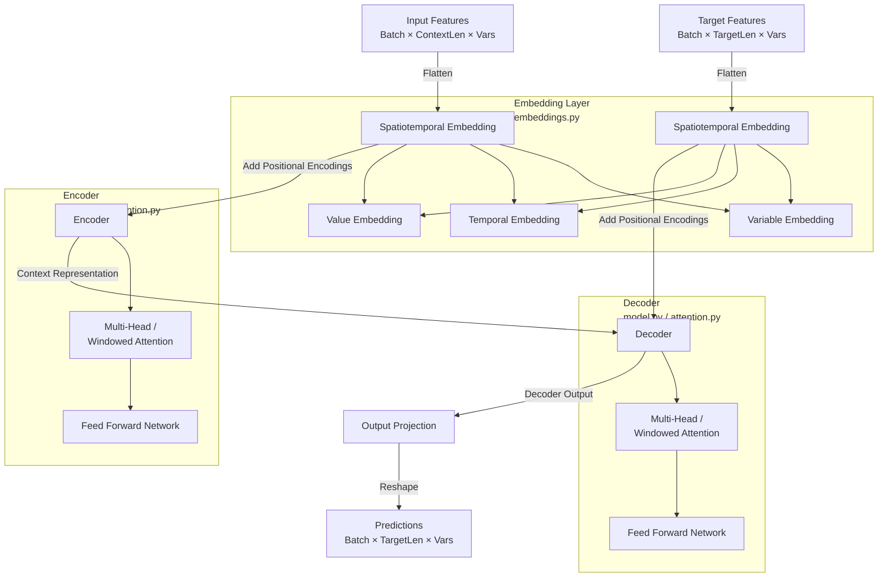

# SpaceTimeFormer Model Architecture

This document describes the current architecture of the SpaceTimeFormer model for multivariate time series forecasting, as implemented in the `future_prices/spacetransformer_model` directory.

## Overview

The model is based on the SpaceTimeFormer architecture, which treats multivariate time series as a flattened sequence of tokens, where each token represents a single variable at a single timestep. This allows the model to learn relationships across both time and variables simultaneously using attention mechanisms.

### Data Flow Diagram

## detailed Component Breakdown

### 1. Data Loading & Preprocessing (`data_loader.py`)
- **Input:** Multivariate time series data (CSV).
- **Processing:** 
    - Loads data, handles date columns.
    - Excludes forward-looking columns (`PctChange_*`) to prevent leakage, but keeps target columns (`High`, `Low`, `Close`) as features.
    - Splits into train/test sets.
    - Scales features using `StandardScaler`.
- **Output:** Normalized feature matrix `X` `(samples, n_features)`.

### 2. Dataset & Batching (`train.py`)
- **Class:** `TimeSeriesDataset`
- **Function:** Creates sliding windows for training.
- **Context Window:** Past `context_length` timesteps (e.g., 48).
- **Target Window:** Future `target_length` timesteps (e.g., 24).
- **Output:** 
    - `context_X`: Features for the context window.
    - `target_X`: Features for the target window (used for teacher forcing/loss).

### 3. Spatiotemporal Embedding (`embeddings.py`)
- **Goal:** Convert discrete variable-time points into vector representations.
- **Mechanism:**
    - **Flattening:** Input `(batch, seq_len, n_vars)` $\rightarrow$ `(batch, seq_len * n_vars, 1)`.
    - **Value Projection:** Projects the scalar value to `d_model` dimensions.
    - **Temporal Embedding:** Learnable embedding based on timestep position.
    - **Variable Embedding:** Learnable embedding based on variable ID.
    - **Combination:** $Emb = ValueEmb + TemporalEmb + VariableEmb$.

### 4. Attention Mechanism (`attention.py`)
- **Standard Attention:** `MultiHeadSpatiotemporalAttention` computes full $O(N^2)$ attention.
- **Windowed Attention:** `WindowedAttention` (currently used) restricts attention to a local window around each token to reduce memory complexity to $O(N \times W)$.
    - **Optimization:** Uses **Gradient Checkpointing** (`torch.utils.checkpoint`) to trade compute for memory, allowing training on very long sequences (e.g., ~20k tokens) without OOM errors.
    - **Implementation:** Processes sequence in chunks, recomputing activations during backward pass.

### 5. Model Architecture (`model.py`)
- **Class:** `SpaceTimeFormer`
- **Encoder-Decoder Structure:**
    - **Encoder:** Processes `context_X`. Stacks of `SpatiotemporalTransformerBlock`.
    - **Decoder:** Processes `target_X` (during training) or generated sequence. Stacks of `SpatiotemporalTransformerBlock`.
- **Projection:** Maps decoder output `(batch, target_len * n_vars, d_model)` $\rightarrow$ `(batch, target_len, n_vars, 1)` -> `(batch, target_len, n_vars)`.
- **Loss:** Computed on specific target columns (`Close`, `High`, `Low`) via `target_indices`, while the model predicts all variables.

### 6. Training Loop (`train.py`, `runner.py`)
- **Loss Function:** MSE Loss on selected target columns.
- **Optimizer:** AdamW with `ReduceLROnPlateau` scheduler.
- **Validation:** Tracks metrics (MSE, MAE, RMSE, R²) on the target columns.

---

## Possible Improvements

### 1. Positional Encoding
- **Current:** Learnable temporal embeddings + periodic encodings.
- **Improvement:** Explore **Rotary Positional Embeddings (RoPE)** or **ALiBi** for better handling of long sequences and relative distances, which is crucial for time series.

### 2. Attention Mechanism
- **Current:** Windowed attention with a fixed window size.
- **Improvement:** 
    - **Global Tokens:** Add "global" tokens that attend to everything (and everything attends to them) to allow long-range information flow even with windowed attention.
    - **Dilated Attention:** Use dilated windows (like BigBird or Longformer) to capture longer range dependencies without increasing compute.
    - **Performer / Linear Attention:** Approximate full attention with linear complexity methods.

### 3. Decoder Strategy
- **Current:** Univariate-style decoding (or simple replication of encoder state for inference initialization).
- **Improvement:** Implement a proper **Autoregressive Decoder** for inference. Currently, `validate` uses `batch_target_X` (teacher forcing) for loss calculation. For true multi-step forecasting, the model should feed its own predictions back as input for the next step.

### 4. Loss Function
- **Current:** MSE.
- **Improvement:** 
    - **Probabilistic Loss:** Predict a distribution (e.g., Gaussian, Quantiles) instead of a point estimate to quantify uncertainty.
    - **Differentiable Sharpe Ratio:** If the goal is trading, optimizing directly for financial metrics might be better.

### 5. Features
- **Current:** Raw values + indicators.
- **Improvement:**
    - **Time Features:** Explicitly embed "Time of Day", "Day of Week" as separate features rather than just sequential indices.
    - **Static Covariates:** Add embeddings for static features (e.g., asset metadata) if training across multiple assets.

### 6. Hyperparameters
- **Current:** Fixed `d_model=64`, `n_heads=4` to save memory.
- **Improvement:** With Gradient Checkpointing now working, we might be able to increase `d_model` or `n_heads` slightly, or increase the `batch_size`.

